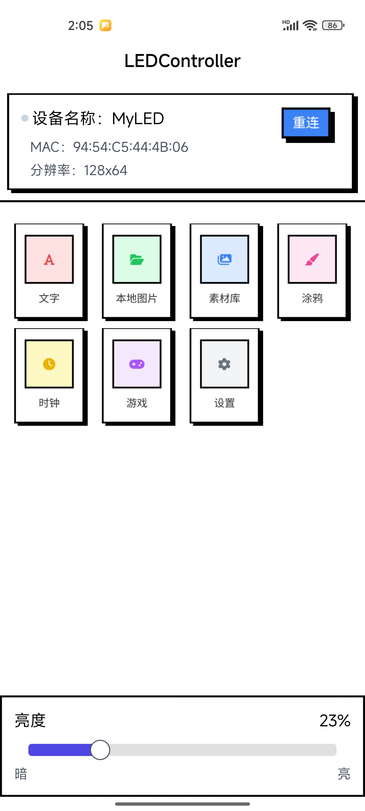

# LED Controller - ESP32 HUB75E LED矩阵控制器

一个基于ESP32和HUB75E LED矩阵的智能LED显示控制器项目，支持Android App远程控制，实现文字显示、图片绘制、GIF动画播放、计时游戏等功能。

## 📱 项目演示

🎬 **[观看完整演示视频](https://www.bilibili.com/video/BV19r4iz5Eeo/?vd_source=a04a7343930f07c5b8e3583fdc3b1303)**

## 🖼️ 项目展示

### 硬件展示

ESP32开发板与HUB75E LED矩阵模块


64x64 LED矩阵显示效果

### Android应用界面

主界面 - 支持文字显示、亮度调节、设备连接管理、时钟显示


涂鸦功能 - 64x64像素画布，支持实时绘制和图片选择


文字显示 - 支持静态文字和滚动文字，多种字体大小


素材库 - 支持多种GIF动画播放和图片显示

## ✨ 主要特性

### 🎯 核心功能
- **文字显示**: 支持静态和滚动文字显示，通过开关控制，多种字体大小和滚动速度
- **图片绘制**: 64x64像素画布，支持实时绘制和图片选择
- **GIF动画**: 内置多种GIF动画，支持循环播放
- **计时游戏**: 数字计时游戏，考验反应能力
- **时钟显示**: 实时时钟显示功能
- **亮度调节**: 0-100%亮度调节
- **蓝牙控制**: 通过BLE协议远程控制，支持MTU和PHY优化

### 📱 Android应用特性
- **直观界面**: 简洁易用的用户界面，Material Design风格
- **实时控制**: 实时调节亮度和绘制
- **设备管理**: 自动连接和重连功能，支持设备配对
- **多语言支持**: 中文界面
- **配置保存**: 自动保存用户偏好设置
- **连接优化**: 支持MTU协商和PHY协商，提升传输效率
- **图片处理**: 支持多种图片格式，自动缩放和优化

### 🔧 硬件特性
- **ESP32主控**: 强大的WiFi+蓝牙双模芯片
- **HUB75E接口**: 标准LED矩阵驱动接口
- **64x64分辨率**: 4096个LED像素点
- **高刷新率**: 流畅的显示效果
- **低功耗设计**: 节能环保

## 🛠️ 技术架构

### 硬件架构
```
ESP32 → HUB75E接口 → LED矩阵
  ↓
蓝牙BLE ← → Android App
```

### 软件架构
- **Arduino固件**: ESP32端控制程序
- **Android应用**: 用户控制界面 (Kotlin + ViewBinding)
- **BLE协议**: 设备通信协议，支持MTU/PHY优化
- **图形处理**: 图像转换和显示算法
- **游戏引擎**: 计时游戏逻辑

### 技术栈
- **Android**: Kotlin 1.9.20, AndroidX, ViewBinding
- **蓝牙**: 自定义BLE库，支持连接优化
- **图像处理**: Glide图片加载，自定义图像处理器
- **协程**: Kotlin Coroutines异步处理
- **权限管理**: RxPermissions动态权限申请

## 📦 项目结构

```
LEDController/
├── android/                    # Android应用
│   └── LedControllerApp/
│       ├── app/src/main/
│       │   ├── java/          # 应用代码
│       │   │   ├── ui/        # 界面Activity
│       │   │   ├── logic/     # 业务逻辑
│       │   │   ├── model/     # 数据模型
│       │   │   ├── utils/     # 工具类
│       │   │   └── constants/ # 常量定义
│       │   ├── res/           # 资源文件
│       │   └── AndroidManifest.xml
│       ├── vt_ble/            # 自定义蓝牙库
│       ├── vt_base/           # 基础库
│       └── build.gradle.kts   # 构建配置
├── arduino_esp32/             # ESP32固件
│   └── myled_hub75e/
│       ├── myled_hub75e.ino   # 主程序
│       ├── config.h           # 配置文件
│       └── *.cpp/*.h          # 功能模块
├── archives/             
│   ├── app-release.apk        # Android APK
│   └── myled_hub75e_complete.bin # ESP32固件
├── art/                       # 项目图片
│   ├── app_main.jpg          # 应用主界面
│   ├── app_graffiti.jpg      # 涂鸦界面
│   ├── app_text.jpg          # 文字显示界面
│   ├── app_gif_list.jpg      # 素材库界面
│   ├── app_icon.png          # 应用图标
│   ├── esp32_board.png       # ESP32开发板
│   └── led_display.jpg       # LED显示效果
└── README.md                 # 项目说明
```

## 🚀 快速开始

### 硬件准备
1. **ESP32开发板** × 1
2. **HUB75E LED矩阵** (64x64) × 1
3. **连接线** 若干
4. **电源适配器** (5V/3A)

### 软件安装
1. **Arduino IDE** 或 **PlatformIO**
2. **Android Studio** (用于编译Android应用)
3. **Android设备** (Android 6.0+)

### 硬件连接
```
ESP32和HUB75E屏幕连接：
R1 -> 25       G1-> 26
B1 -> 27       GND-->GND
R2 ->14       G2->12
B2  ->13      E-> 32
A   ->23       B-> 22
C  -> 5         D->17
CLK-> 16     LAT->4
OE-> 15     GND->GND
```

### 固件烧录
1. 打开Arduino IDE
2. 选择ESP32开发板
3. 打开 `arduino_esp32/myled_hub75e/myled_hub75e.ino`
4. 编译并上传到ESP32

### Android应用安装
1. 使用Android Studio打开 `android/LedControllerApp/`
2. 连接Android设备
3. 编译并安装应用
4. 或直接安装 `archives/app-release.apk`

## 📖 使用说明

### 首次使用
1. 打开Android应用
2. 确保蓝牙已开启
3. 点击"重连"按钮
4. 等待设备连接成功

### 文字显示
1. 点击"文字"按钮进入文字显示界面
2. 在输入框中输入要显示的文字
3. 调节文字大小（极小/小/中/大）
4. 使用滚动开关控制文字是否滚动显示
   - 关闭滚动：文字静态显示
   - 开启滚动：文字滚动显示，可调节滚动速度（慢/中/快）
5. 点击"发送"按钮

### 涂鸦功能
1. 点击"涂鸦"按钮进入绘图界面
2. 选择绘制模式（拖拽/填充）
3. 在64x64画布上绘制图案
4. 开启"实时更新"可实时显示到LED
5. 支持选择手机图片进行显示

### 素材库
1. 点击"素材库"按钮进入GIF列表
2. 选择要播放的GIF动画
3. 点击播放按钮
4. 支持发送进度显示

### 计时游戏
1. 点击"计时游戏"按钮进入游戏界面
2. 查看LED屏幕显示的目标时间
3. 点击"开始游戏"按钮
4. 当LED计时到达目标时间时点击"停止计时"
5. 系统会显示游戏结果

### 时钟显示
1. 在主界面点击时钟开关
2. LED屏幕会显示实时时钟
3. 再次点击可关闭时钟显示

### 亮度调节
1. 在主界面调节亮度滑块
2. 亮度范围：0-100%
3. 设置会自动保存

### 连接优化
- 应用会自动进行MTU协商，提升传输效率
- 支持PHY协商，优化连接质量
- 支持设备配对，提升连接稳定性

## 🔧 配置说明

### ESP32配置
在 `arduino_esp32/myled_hub75e/config.h` 中：
```cpp
// LED矩阵配置
#define MATRIX_WIDTH 64
#define MATRIX_HEIGHT 64
#define MATRIX_PANELS 1

// 蓝牙配置
#define DEVICE_NAME "MyLED"
#define SERVICE_UUID "4fafc201-1fb5-459e-8fcc-c5c9c331914b"
```

### Android配置
在 `android/LedControllerApp/app/src/main/java/com/vincent/android/ledcontroller/constants/BleConstants.kt` 中：
```kotlin
// 蓝牙设备名称
const val DEVICE_NAME = "MyLED"

// LED 服务UUID
const val LED_SERVICE_UUID = "4fafc201-1fb5-459e-8fcc-c5c9c331914b"

// 特征UUID
const val LED_CHARACTERISTIC_CONTROL_UUID = "beb5483e-36e1-4688-b7f5-ea07361b26c0"
const val LED_CHARACTERISTIC_GIF_UUID = "beb5483e-36e1-4688-b7f5-ea07361b26b1"
const val LED_CHARACTERISTIC_BRIGHTNESS_UUID = "beb5483e-36e1-4688-b7f5-ea07361b26a9"
```

**注意**: 应用现在通过设备名称"MyLED"自动扫描和连接设备，无需手动配置设备地址。

## 🎮 游戏说明

### 计时游戏规则
1. LED屏幕会随机显示一个目标时间（如09:35）
2. 按下开始按钮后LED开始计时
3. 当计时到达目标时间时按下停止按钮即可获胜
4. 游戏考验玩家的反应能力和时间感知

## 🐛 故障排除

### 常见问题

**Q: 设备连接失败**
A: 检查蓝牙是否开启，设备是否在范围内，尝试重启应用

**Q: LED显示异常**
A: 检查硬件连接，确认电源电压稳定

**Q: 应用崩溃**
A: 检查Android版本兼容性，重新安装应用

**Q: 涂鸦功能无响应**
A: 确认设备已连接，检查实时更新开关

**Q: 图片发送失败**
A: 检查图片大小，确保设备连接正常

**Q: 游戏无法开始**
A: 确认设备已连接，检查LED屏幕是否正常显示

## 🤝 贡献指南

欢迎提交Issue和Pull Request！

### 开发环境
- Arduino IDE 1.8.x 或 PlatformIO
- Android Studio 4.x+
- ESP32开发板
- Android设备 (Android 6.0+)

### 代码规范
- 遵循Arduino和Android开发规范
- 添加适当的注释
- 保持代码简洁清晰
- 使用Kotlin协程进行异步处理

## 📄 许可证

本项目采用 MIT 许可证 - 查看 [LICENSE](LICENSE) 文件了解详情

## 🙏 致谢

- ESP32 Arduino库
- HUB75E LED矩阵驱动库
- Android BLE库
- 所有贡献者和测试用户

## 📞 联系方式

- **项目主页**: [GitHub Repository](https://github.com/VincentTung/LEDController)
- **演示视频**: [Bilibili](https://www.bilibili.com/video/BV19r4iz5Eeo/?vd_source=a04a7343930f07c5b8e3583fdc3b1303)
- **问题反馈**: [Issues](https://github.com/VincentTung/LEDController/issues)

---

⭐ 如果这个项目对您有帮助，请给我一个Star！

⭐ 如果您觉得我帮你节省了大量的开发时间，请扫描下方的二维码随意打赏，要是能打赏个 10.24 🐵就太👍了。您的支持将鼓励我继续进行分享。
